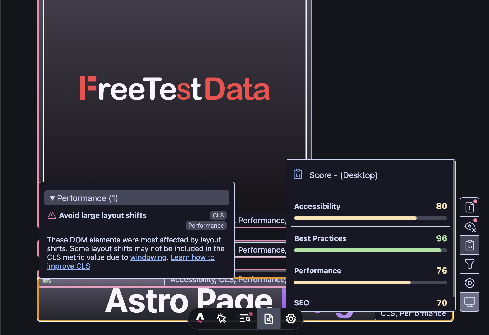

# `astro-page-insight`



This is an [Astro integration](https://docs.astro.build/en/guides/integrations-guide/) that shows everything to improve from Lighthouse results directly on the page.

## Usage

### Prerequisites

You need to have Chrome.

if you see errors like `ERR_LAUNCHER_NOT_INSTALLED`, you may need to install Chrome.


### Installation

Install the integration **automatically** using the Astro CLI:

```bash
pnpm astro add astro-page-insight
```

```bash
npx astro add astro-page-insight
```

```bash
yarn astro add astro-page-insight
```

Or install it **manually**:

1. Install the required dependencies

```bash
pnpm add astro-page-insight
```

```bash
npm install astro-page-insight
```

```bash
yarn add astro-page-insight
```

2. Add the integration to your astro config

```diff
+import pageInsight from "astro-page-insight";

export default defineConfig({
  integrations: [
+    pageInsight(),
  ],
});
```

### Configuration


Here is the options:

```ts
options: z.object({
  /**
  * `weight` is the threshold value in the audit.
  * All audit items have weights assigned by lighthouse and can be filtered by thresholds(`weight`).
  *
  * @default `0`
  */
  weight: z.number().optional().default(0),
  /**
  * `breakPoint` is used to determine whether on mobile or desktop.
  * if the viewport width is less than the `breakPoint`, the lighthouse will run as a mobile device.
  *
  * @default `767`
  */
  breakPoint: z.number().optional().default(767),
})
```

## Contributing

This package is structured as a monorepo:

- `playground` contains code for testing the package
- `package` contains the actual package

Install dependencies using pnpm: 

```bash
pnpm i --frozen-lockfile
```

Start the playground:

```bash
pnpm playground:dev
```

You can now edit files in `package`. Please note that making changes to those files may require restarting the playground dev server.

## Licensing

[MIT Licensed](https://github.com/ktym4a/astro-page-insight/blob/main/LICENSE). Made with ❤️ by [ktym4a](https://github.com/ktym4a).

<!-- ## Acknowledgements

TODO: -->
